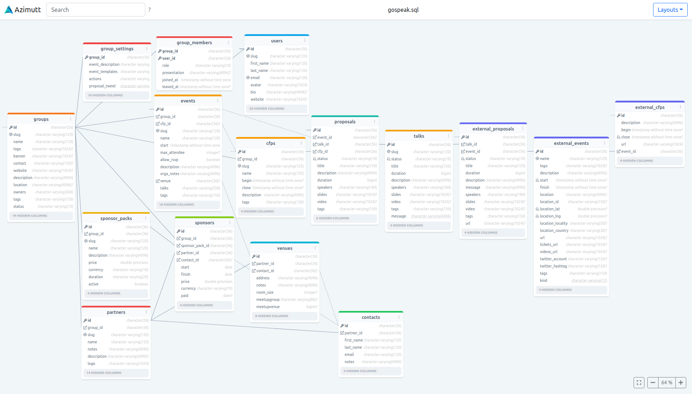

# Azimutt

[](https://app.netlify.com/sites/azimutt/deploys)

An Entity Relationship diagram (ERD) visualization tool, with various filters and inputs to help understand your SQL
schema.

Why building my own ?

Most ERD tool I looked into ([DrawSQL](https://drawsql.app), [dbdiagram.io](https://dbdiagram.io)
, [Lucidchart](https://www.lucidchart.com/pages/examples/er-diagram-tool), [ERDPlus](https://erdplus.com)
, [Creately](https://creately.com/lp/er-diagram-tool-online), [SqlDBM](https://sqldbm.com)
, [QuickDBD](https://www.quickdatabasediagrams.com)) are focusing on creating/editing the schema (collaboratively) and
displaying it (statically). This is nice when starting a new project with a few tables but doesn't really help when you
discover an existing one with hundreds of tables and relations.

I really miss an interactive exploration tool with features like:

- filter/show/hide some tables
- filter/show/hide some columns
- search for tables, columns or even in metadata
- tag tables and columns to define meaningful groups (team ownership, domain exploration...)
- rich UI infos with:
    - source links (schema file but also app models)
    - database statistics (table size, column value samples)
    - team/code ownership (git blame or specific format)
    - tables/columns updates (from migrations files or schema file history)

For me, this tool is the missing piece between a classic ERD tool and a Data catalog:



## Installation

[Azimutt](https://azimutt.app) is a Single Page Application built with Elm that parse and explore your database schema.

Dependencies:

```npm install -g elm elm-spa```

Dev commands:

- launch dev server: `npm start` or `npm run dev` to not run npm install first
- build production: `npm run build`
- preview production build: `npm run serve`
- launch design system: `elm-book src/Components/Book.elm --dir=public --start-page=book.html --port 8001 -- --output=public/dist/book.js` (needs `npm install -g elm-book` or use `npx`)
- launch the tests: `elm-test` (needs `npm install -g elm-test` or use `npx`)
- run linter: `elm-review` (needs `npm install -g elm-review` or use `npx`)
- check format: `elm-format src tests --validate` (needs `npm install -g elm-format` or use `npx`)
- run coverage: `elm-coverage --open` (needs `npm install -g elm-coverage`) (**doesn't work with elm-spa**)
- install deps `elm-json install author/package` (needs `npm install --g elm-json`)
- uninstall deps `elm-json uninstall author/package`
- update deps `elm-json upgrade` (use `--unsafe` flag for major versions)

Elm folders are `src` for sources, `tests` for tests and `public` for static assets.

When developing, please enable git hooks on your machine using: `git config --local core.hooksPath .githooks`

## License

The tool is available as open source under the terms of the [MIT License](https://opensource.org/licenses/MIT).
