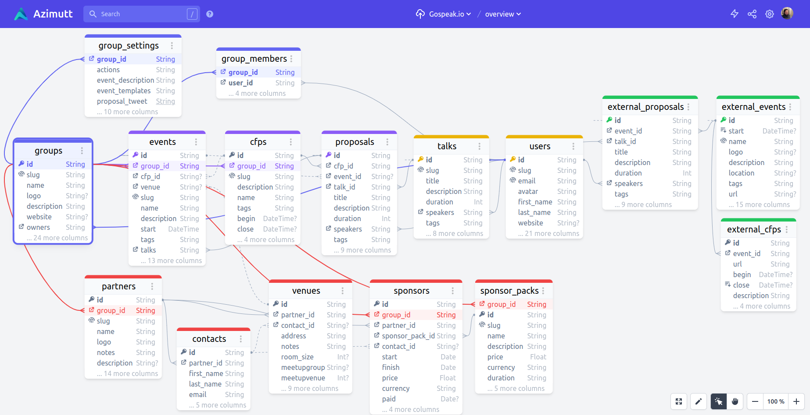
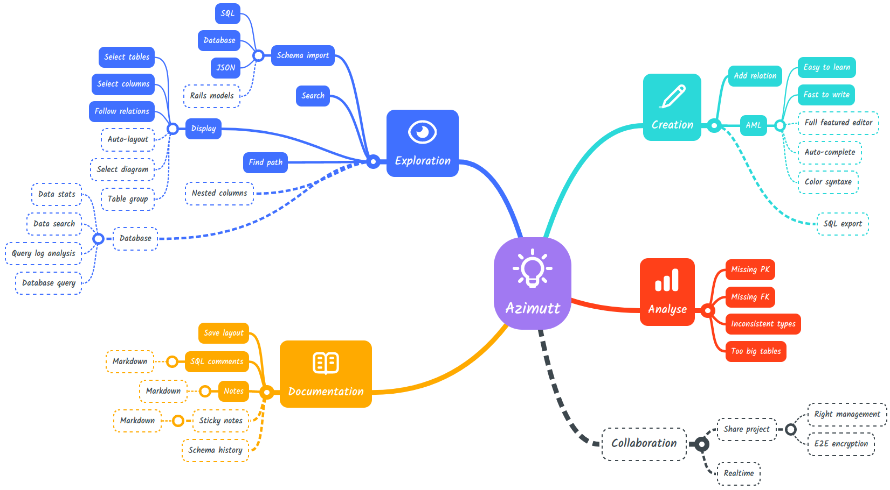

    <a href="https://azimutt.app" target="_blank">
        <picture>
          <source media="(prefers-color-scheme: dark)" srcset="backend/priv/static/images/logo_light.svg">
          <source media="(prefers-color-scheme: light)" srcset="backend/priv/static/images/logo_dark.svg">
          
        </picture>
    </a>

<h3 align="center">Next gen ERD</h3>

Design, Explore, Document and Analyze your database

  <a href="https://azimutt.app" target="_blank">azimutt.app</a> •
  <a href="https://github.com/azimuttapp/azimutt/projects/1" target="_blank">roadmap</a> •
  <a href="https://twitter.com/azimuttapp" target="_blank">@azimuttapp</a>

Azimutt is an Entity Relationship Diagram (ERD) targeting real world database schema (big & messy).

**Why building Azimutt?**

Databases existed for more than 40 years and despite a lot of tool around them, we couldn't find any providing a great exploration experience.

- **Database clients** focus on querying experience, with auto-completion and table/column lists but no visual help
- **ERDs** have a great diagram UI but fall short when schema is growing (real-world use cases)
- **Data catalogs** are primarily focused on data governance and lineage on big data sector

So we decided to built it 💪

Azimutt started as a schema exploration tool for databases with hundreds of tables, but now it has grown a lot:

- Design your schema using [AML](docs/aml/README.md) for a fast diagramming
- Explore your database using search everywhere, display only useful tables/columns and follow relations
- Document it with layouts for use cases, features or team scopes and table/column notes
- Analyze it to discover inconsistencies and best practices

Azimutt goal is to be your ultimate tool to understand your database.

## Local development

Azimutt is built with [Elm](https://elm-lang.org)/[elm-spa](https://www.elm-spa.dev) (editor) and [Elixir](https://elixir-lang.org)/[Phoenix](https://www.phoenixframework.org) (backend & admin).

For local development you will need to set up the environment:

- install `npm`, [Elm](https://guide.elm-lang.org/install/elm.html) & [elm-spa](https://www.elm-spa.dev)
- install [Phoenix](https://hexdocs.pm/phoenix/installation.html) and [Elixir](https://elixir-lang.org/install.html) if needed
- install [PostgreSQL](https://www.postgresql.org/download) with a user `postgres` and password `postgres`
- install [pre-commit](https://pre-commit.com) and run `pre-commit install` before committing
- run `npm run setup` to install dependencies and configure your environment

Then you can choose to launch either:

- `npm run ex:dev` for Elixir server (frontend will still be available through compiled files)
- `npm run elm:dev` for Elm/TypeScript frontend (useful when do develop on front)
- `npm run dev` for both with live reload

Now you can visit :

- [`localhost:4000`](http://localhost:4000) for the main app
- [`localhost:4000/api/v1/swagger`](http://localhost:4000/api/swagger) for the Swagger documentation
- [`localhost:4000/storybook`](http://localhost:4000/storybook) for the Storybook

⚠️ to launch the app you will need a few environment variables: `STRIPE_API_KEY`, `STRIPE_WEBHOOK_SIGNING_SECRET`, `MAILGUN_API_KEY`, `MAILGUN_DOMAIN`, `GITHUB_CLIENT_ID`, `GITHUB_CLIENT_SECRET`

⚠️ Please see [Setup Stripe](#setup-stripe).

### Development commands

- `npm run elm:book` to launch the Elm design system

### Setup Stripe

#### Config

- Install [Stripe CLI](https://stripe.com/docs/stripe-cli) and login with `stripe login`
- Run `stripe listen --forward-to localhost:4000/webhook/stripe`
- Copy your webhook signing secret to your `.env`, it's look like (`whsec_XXX`)
- Go to [your Stripe dashboard](https://dashboard.stripe.com/test/apikeys) to obtain your API Key and copy it into `STRIPE_API_KEY` in your `.env` file.

#### Payments

When testing interactively, use a card number, such as `4242 4242 4242 4242`. Enter the card number in the Dashboard or in any payment form.
Use a valid future date, such as `12/34`.
Use any three-digit CVC like `123` (four digits for American Express cards).
Use any value you like for other form fields.

See more in the [stripe testing documentation](https://stripe.com/docs/testing)

## Stack

* [Production](https://azimutt.app) & [Staging](https://azimutt.dev) on Clever Cloud
* [Error logs](https://sentry.io/organizations/azimuttapp/issues/?project=6635088) with [Sentry](https://sentry.io)
* Design using [TailwindCSS Framework](https://tailwindcss.com)
* [Credo](http://credo-ci.org) for static code analysis (automatically run with pre-commit)

## License

The tool is available as open source under the terms of the [MIT License](https://opensource.org/licenses/MIT).
