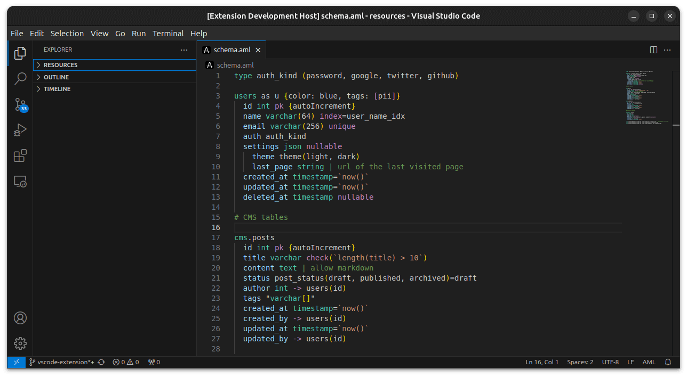

# AML Support for VS Code

This Visual Studio Code extension provides language support for [AML](https://azimutt.app/aml), an easy DSL to design database schemas.

## Features

- syntax highlighting and snippets (`.aml` files)
- convert AML to PostgreSQL, JSON, DOT, Mermaid, Markdown (Command Palette)
- convert SQL and JSON to AML (Command Palette)

## Roadmap

- Add parsing errors
- auto-complete
- quick-fixes (code actions)
- Go-to-definition for relations (cf https://microsoft.github.io/monaco-editor/typedoc/interfaces/languages.DocumentSymbolProvider.html)
- hover info
- Add diagram preview & Open in Azimutt
- Add AML support in Markdown
- Connect to a database

## Issues & Contributing

If you have any issue or bug, please [create an issue](https://github.com/azimuttapp/azimutt/issues).

If you want to improve this extension, feel free to reach out or submit a pull request.

## Development

Here are some interesting VS Code documentation you may find helpful:

- [VS Code extension get started](https://code.visualstudio.com/api/get-started/your-first-extension).
- [Language Configuration Guide](https://code.visualstudio.com/api/language-extensions/language-configuration-guide)
- [Syntax Highlight Guide](https://code.visualstudio.com/api/language-extensions/syntax-highlight-guide) & [Semantic Highlight Guide](https://code.visualstudio.com/api/language-extensions/semantic-highlight-guide)
- [Snippet Guide](https://code.visualstudio.com/api/language-extensions/snippet-guide)

Tips:

- Debug extension via F5 (Run Web Extension)
- Relaunch the extension from the debug toolbar after changing code in `src/web/extension.ts`
- Reload (`Ctrl+R` or `Cmd+R` on Mac) the VS Code window with your extension to load your changes

## Publication

[Publish your extension](https://code.visualstudio.com/api/working-with-extensions/publishing-extension) on the VS Code extension marketplace.
