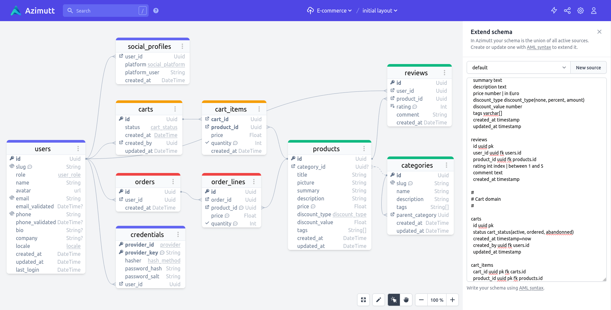

<p align="center">
    <a href="https://azimutt.app/aml" target="_blank" rel="noopener">
        <picture>
          <source media="(prefers-color-scheme: dark)" srcset="logo-white.png">
          <source media="(prefers-color-scheme: light)" srcset="logo.png">
          
        </picture>
    </a>
</p>

<p align="center">
  <a href="https://azimutt.app/aml" target="_blank" rel="noopener">Home page</a> •
  <a href="https://azimutt.app/converters/aml" target="_blank" rel="noopener">Converter</a> •
  <a href="https://www.npmjs.com/package/@azimutt/aml" target="_blank" rel="noopener">npm package</a>
</p>

**AML** (Azimutt Markup Language) is the **easiest language to design databases**.  
It's made to be fast to learn and write, with very few keywords or special characters.


## Why AML?

- **Structured text** is WAY better than GUI: portable, copy/paste, find/replace, versioning, column edition...
- It's **simpler, faster to write and less error-prone than SQL** or other database schema DSLs
- **Made for humans**: readable, flexible, can hold [custom properties](./properties.md)
- **Database agnostic**: hold concepts, not specific syntax, can be [converted to other dialects](https://azimutt.app/converters/aml)
- **Free** as 🕊️ but also 🍺

In short, it's perfect for fast prototyping and brainstorming.


## Example

```aml
users
  id uuid pk
  name varchar
  email varchar index
  role user_role(admin, guest)=guest

posts
  id uuid pk
  title varchar
  content text | formatted in markdown
  created_at timestamp=`now()`
  created_by uuid -> users(id) # inline relation
```


## Introduction

This page will give you a **quick overview** of how to use AML, follow links for a more exhaustive specification.

- [Entities](#entities)
- [Relations](#relations)
- [Types](#types)
- [Migration from v1](#migration-from-v1)
- [Full example](#full-example)
- [Other database schema DSLs](#other-database-schema-dsls)

One last thing, AML [comments](./comment.md) are single line and start with `#`, you will see them in many places 😉


## Entities

[Entities](./entity.md) can be used to model data objects from databases, such as **tables** or **collections** in databases.

Defining one in AML can't be simpler, just type its name:

```aml
posts
```

Entities can have attributes with several options like a type, nullability, indexes, constraints and relations.

Here is how they look:

```aml
posts
  id uuid pk
  slug varchar(256) unique
  title varchar index
  status post_status(draft, published, archived)=draft index
  content text nullable
  tags "varchar[]"
  props json
    needs_review bool
    reviewed_by -> users(id)
  created_by -> users(id)
  created_at "timestamp with time zone"=`now()`
```

You can define them inside a [namespace](./namespace.md) and give them an [alias](./entity.md#alias) name for easier referencing:

```aml
core.public.users as u
  id uuid pk
  name varchar

core.public.posts as p
  id uuid pk
  title varchar
  created_by -> u(id)
```

And you can document them both with structured [properties](./properties.md) or unstructured [documentation](./documentation.md):

```aml
events {color: yellow, scope: tracking} | store all user events
  id uuid pk
  name varchar index | should be structured with `context__object__action` format
  item_kind varchar {values: [users, posts, projects]} | polymorphic relation
  item_id uuid
```


## Relations

[Relations](./relation.md) can model references, like foreign keys, or source for lineage, depending on how you want to use them.

They mostly use the `->` symbol in entity definition (like used above) but can also be defined standalone with the `rel` keyword and use other cardinality with `--` for [one-to-one](./relation.md#one-to-one) and `<>` for [many-to-many](./relation.md#many-to-many).

```aml
users
  id uuid pk

profiles
  id uuid pk
  user_id uuid -- users(id)

projects
  id uuid pk <> users(id)
  created_by -> users(id)

events
  id uuid pk
  created_by uuid

rel events(created_by) -> users(id)
```

For fasted definition, you can omit the target attribute when the target table has a primary key with a single attribute.
As well as the attribute type, it will be inherited from the target attribute:

```aml
users
  id uuid pk

events
  id uuid pk
  created_by -> users
```

AML supports [polymorphic relations](./relation.md#polymorphic-relation) by adding the kind attribute key and value inside the relation symbol:

```aml
users
  id uuid pk

projects
  id uuid pk

events
  id uuid pk
  item_kind event_items(users, projects)
  item_id
  created_by -> users

rel events(item_id) -item_kind=users> users
rel events(item_id) -item_kind=projects> projects
```

It also supports [composite relations](./relation.md#composite-relation) by listing the used attributes in the parenthesis:

```aml
credentials
  provider_key varchar pk
  provider_uid varchar pk
  user_id -> users

credential_details
  provider_key varchar pk
  provider_uid varchar pk
  provider_data json

rel credential_details(provider_key, provider_uid) -> credentials(provider_key, provider_uid)
```

Of course, relations can be used with nested attributes:

```
users
  id int pk
  friends json[]
    id number -> users(id)

events
  id uuid pk
  details json
    user_id number

rel events(details.user_id) -> users(id)
```


## Types

You can also create [custom types](./type.md) for better semantics, consistency or re-usability.

They can be defined inline in the entity attribute definition when not re-used, on standalone for more global usage:

```aml
type my_type # just a named type for better semantics
type id_type uuid # here is a type alias
type bug_status (draft, "in progress", done) # enums are quite useful and explicit
type position {x int, y int} # even structs can be defined
type float8_range `RANGE (subtype = float8, subtype_diff = float8mi)` # custom types allows any complex definition
```


## Migration from v1

This new version of AML is coming 2 years after the first one ([post](https://azimutt.app/blog/aml-a-language-to-define-your-database-schema) & [PR](https://github.com/azimuttapp/azimutt/pull/98) ^^).
During this time we discovered a lot of new use cases and some shortcomings (such as composite foreign keys).

This new iteration fixes the issues, improve consistency and add nice features such as [namespace](./namespace.md), [properties](./properties.md), [nested attributes](./entity.md#nested-attribute), [polymorphic relations](./relation.md#polymorphic-relation) and more.

We made it mostly retro-compatible, so you only have to fix the issued warnings in most cases. If you want to look at what needs to be adapted, look at the [migration doc](./migration.md).


## Full example

Now let's write a longer AML example to see how it looks like to design your database schema with AML.
This example won't use every available feature on AML but give you a good idea of the kind of code you will write using AML.

Let's define a theoretical e-commerce shop:



```aml
#
# Identity domain
#

users
  id uuid pk
  slug varchar unique | user identifier in urls
  role user_role(customer, staff, admin)
  name varchar
  avatar url
  email varchar unique
  email_validated timestamp nullable
  phone varchar unique
  phone_validated timestamp nullable
  bio text nullable
  company varchar nullable
  locale locale(en, fr)
  created_at timestamp
  updated_at timestamp
  last_login timestamp

credentials
  provider_id provider(google, facebook, twitter, email) pk
  provider_key varchar pk | user id in provider system
  hasher hash_method(md5, sha1, sha256)
  password_hash varchar
  password_salt varchar
  user_id uuid -> users(id)

social_profiles
  user_id uuid -> users(id)
  platform social_platform(facebook, twitter, instagram, slack, github)
  platform_user varchar
  created_at timestamp

#
# Catalog domain
#

categories
  id uuid pk
  slug varchar unique | category identifier in urls
  name varchar
  description text
  tags "varchar[]"
  parent_category uuid -> categories(id)
  created_at timestamp
  updated_at timestamp

products
  id uuid pk
  category_id uuid nullable -> categories(id)
  title varchar
  picture varchar
  summary text
  description text
  price number | in Euro
  discount_type discount_type(none, percent, amount)
  discount_value number
  tags "varchar[]"
  created_at timestamp
  updated_at timestamp

reviews
  id uuid pk
  user_id uuid -> users(id)
  product_id uuid -> products(id)
  rating int index | between 1 and 5
  comment text
  created_at timestamp

#
# Cart domain
#

carts
  id uuid pk
  status cart_status(active, ordered, abandonned)
  created_at timestamp=`now()`
  created_by uuid -> users(id)
  updated_at timestamp

cart_items
  cart_id uuid pk -> carts(id)
  product_id uuid pk -> products(id)
  price number
  quantity int check=`quantity > 0` | should be > 0
  created_at timestamp

#
# Order domain
#

orders
  id uuid pk
  user_id uuid -> users(id)
  created_at timestamp

order_lines
  id uuid pk
  order_id uuid -> orders(id)
  product_id uuid -> products(id) | used as reference and for re-order by copy data at order time as they should not change
  price number | in Euro
  quantity int check=`quantity > 0` | should be > 0
```

There is even a [much longer example](../../../demos/ecommerce/source_00_design.md) for the [e-commerce full demo](../../../demos/ecommerce/README.md) if you want to have a look.

Hope you enjoyed [AML](https://azimutt.app/aml), happy hacking on [Azimutt](https://azimutt.app)!


## Other database schema DSLs

- [DBML](https://dbml.dbdiagram.io)
- [Quick DBD syntax](https://www.quickdatabasediagrams.com)
- [Quick SQL](https://github.com/oracle/quicksql)
- [Eraser syntax](https://docs.eraser.io/docs/syntax-1)
- suggest more if you know others ;)
