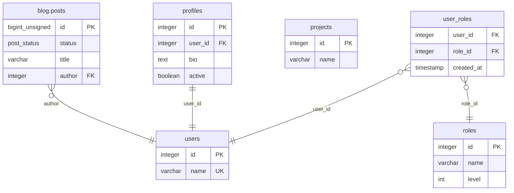

# Database documentation by Azimutt

## Summary

- [Entities](#entities)
  - [blog.posts](#blogposts)
  - [users](#users)
  - [profiles](#profiles)
  - [projects](#projects)
  - [roles](#roles)
  - [user_roles](#userroles)
- [Types](#types)
  - [blog.post_status](#blogpoststatus)
- [Diagram](#diagram)

## Entities

### blog.posts

Stores all posts

| Attribute  | Type            | Properties | Reference | Documentation |
|------------|-----------------|------------|-----------|---------------|
| **id**     | bigint unsigned | PK         |           |               |
| **status** | post_status     |            |           |               |
| **title**  | varchar         |            |           |               |
| **author** | integer         |            | users.id  |               |

### users

| Attribute | Type    | Properties | Reference | Documentation |
|-----------|---------|------------|-----------|---------------|
| **id**    | integer | PK         |           |               |
| **name**  | varchar | unique     |           |               |

### profiles

| Attribute   | Type    | Properties | Reference | Documentation |
|-------------|---------|------------|-----------|---------------|
| **id**      | integer | PK         |           |               |
| **user_id** | integer |            | users.id  |               |
| **bio**     | text    |            |           |               |
| **active**  | boolean |            |           |               |

### projects

| Attribute | Type    | Properties | Reference | Documentation |
|-----------|---------|------------|-----------|---------------|
| **id**    | integer | PK         |           |               |
| **name**  | varchar |            |           |               |

### roles

| Attribute | Type    | Properties | Reference | Documentation |
|-----------|---------|------------|-----------|---------------|
| **id**    | integer | PK         |           |               |
| **name**  | varchar |            |           |               |
| **level** | int     |            |           |               |

### user_roles

| Attribute      | Type      | Properties | Reference | Documentation |
|----------------|-----------|------------|-----------|---------------|
| **user_id**    | integer   |            | users.id  |               |
| **role_id**    | integer   |            | roles.id  |               |
| **created_at** | timestamp | index      |           |               |

## Types

### blog.post_status

ENUM: draft, published, archived

## Diagram

