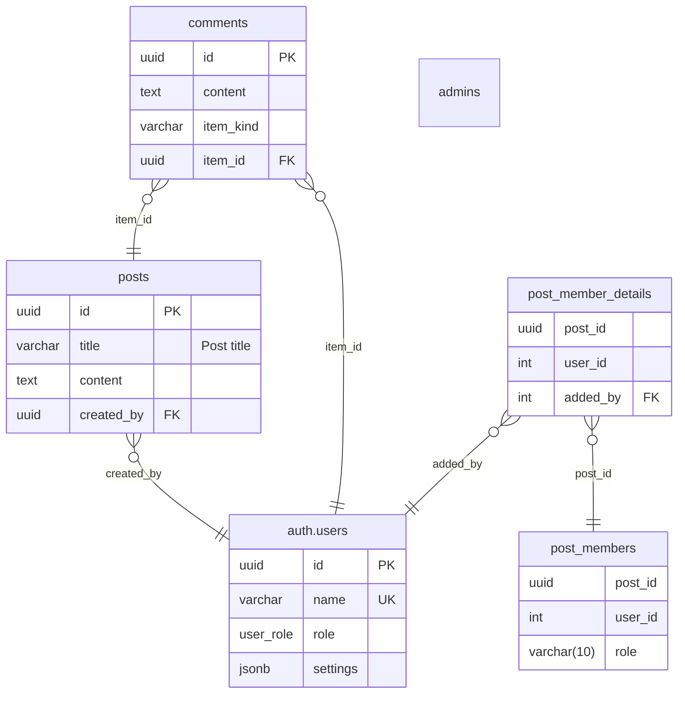

# Database documentation by Azimutt

## Summary

- [Entities](#entities)
  - [auth.users](#authusers)
  - [posts](#posts)
  - [comments](#comments)
  - [post_members](#post_members)
  - [post_member_details](#post_member_details)
  - [admins](#admins)
- [Types](#types)
  - [user_role](#user_role)
- [Diagram](#diagram)

## Entities

### auth.users

| Attribute    | Type      | Properties                | Reference | Documentation |
|--------------|-----------|---------------------------|-----------|---------------|
| **id**       | uuid      | PK                        |           |               |
| **name**     | varchar   | unique, check(name <> '') |           |               |
| **role**     | user_role |                           |           |               |
| **settings** | jsonb     | nullable                  |           |               |

Constraints:

- index on (settings.address.country, settings.address.city, settings.address.street): users_address_index
- check(role = 'admin' AND name LIKE 'a_%'): users_admin_name_chk

### posts

All posts

| Attribute      | Type    | Properties | Reference     | Documentation |
|----------------|---------|------------|---------------|---------------|
| **id**         | uuid    | PK         |               |               |
| **title**      | varchar |            |               | Post title    |
| **content**    | text    |            |               |               |
| **created_by** | uuid    |            | auth.users.id |               |

### comments

| Attribute     | Type    | Properties | Reference                                                   | Documentation |
|---------------|---------|------------|-------------------------------------------------------------|---------------|
| **id**        | uuid    | PK         |                                                             |               |
| **content**   | text    |            |                                                             |               |
| **item_kind** | varchar |            |                                                             |               |
| **item_id**   | uuid    |            | auth.users.id (item_kind=User) or posts.id (item_kind=Post) |               |

### post_members

| Attribute   | Type        | Properties | Reference | Documentation |
|-------------|-------------|------------|-----------|---------------|
| **post_id** | uuid        |            |           |               |
| **user_id** | int         |            |           |               |
| **role**    | varchar(10) |            |           |               |

### post_member_details

| Attribute    | Type | Properties | Reference     | Documentation |
|--------------|------|------------|---------------|---------------|
| **post_id**  | uuid |            |               |               |
| **user_id**  | int  |            |               |               |
| **added_by** | int  |            | auth.users.id |               |

Constraints:

- relation: post_member_details(post_id, user_id) -> post_members(post_id, user_id)

### admins

View definition:
```sql
SELECT * FROM users WHERE role = 'admin'
```

## Types

### user_role

user roles

ENUM: admin, guest

## Diagram


