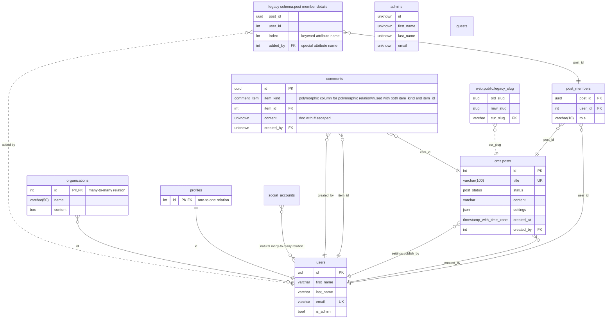

# Database documentation by Azimutt

## Summary

- [Entities](#entities)
  - [users](#users)
  - [cms.posts](#cmsposts)
  - [post_members](#post_members)
  - [legacy schema.post member details](#legacy-schemapost-member-details)
  - [comments](#comments)
  - [web.public.legacy_slug](#webpubliclegacy_slug)
  - [organizations](#organizations)
  - [profiles](#profiles)
  - [admins](#admins)
  - [guests](#guests)
  - [social_accounts](#social_accounts)
- [Types](#types)
  - [comment_item](#comment_item)
  - [slug](#slug)
  - [uid](#uid)
  - [cms.post_status](#cmspost_status)
  - [position](#position)
  - [box](#box)
- [Diagram](#diagram)

## Entities

### users

| Attribute      | Type    | Properties    | Reference | Documentation |
|----------------|---------|---------------|-----------|---------------|
| **id**         | uid     | PK            |           |               |
| **first_name** | varchar |               |           |               |
| **last_name**  | varchar |               |           |               |
| **email**      | varchar | unique, check |           |               |
| **is_admin**   | bool    |               |           |               |

Constraints:

- unique index on (first_name, last_name): name

### cms.posts

| Attribute      | Type                     | Properties                 | Reference | Documentation |
|----------------|--------------------------|----------------------------|-----------|---------------|
| **id**         | int                      | PK                         |           |               |
| **title**      | varchar(100)             | unique, check(title <> '') |           |               |
| **status**     | post_status              |                            |           |               |
| **content**    | varchar                  | nullable                   |           |               |
| **settings**   | json                     | nullable                   |           |               |
| **created_at** | timestamp with time zone |                            |           |               |
| **created_by** | int                      |                            | users.id  |               |

### post_members

| Attribute   | Type        | Properties                          | Reference    | Documentation |
|-------------|-------------|-------------------------------------|--------------|---------------|
| **post_id** | uuid        |                                     | cms.posts.id |               |
| **user_id** | int         |                                     | users.id     |               |
| **role**    | varchar(10) | check(role IN ('author', 'editor')) |              |               |

### legacy schema.post member details

| Attribute    | Type | Properties | Reference | Documentation          |
|--------------|------|------------|-----------|------------------------|
| **post_id**  | uuid |            |           |                        |
| **user_id**  | int  |            |           |                        |
| **index**    | int  |            |           | keyword attribute name |
| **added by** | int  | nullable   | users.id  | special attribute name |

Constraints:

- relation: legacy schema.post member details(post_id, user_id) -> post_members(post_id, user_id)

### comments

a table with most options
looks quite complex but not intended to be used all together ^^

| Attribute      | Type         | Properties | Reference                                                  | Documentation                                                                     |
|----------------|--------------|------------|------------------------------------------------------------|-----------------------------------------------------------------------------------|
| **id**         | uuid         | PK         |                                                            |                                                                                   |
| **item_kind**  | comment_item |            |                                                            | polymorphic column for polymorphic relation\nused with both item_kind and item_id |
| **item_id**    | int          |            | users.id (item_kind=User) or cms.posts.id (item_kind=Post) |                                                                                   |
| **content**    | unknown      |            |                                                            | doc with # escaped                                                                |
| **created_by** | unknown      |            | users.id                                                   |                                                                                   |

Constraints:

- index on (item_kind, item_id): item

### web.public.legacy_slug

| Attribute    | Type    | Properties | Reference               | Documentation |
|--------------|---------|------------|-------------------------|---------------|
| **old_slug** | slug    |            |                         |               |
| **new_slug** | slug    |            |                         |               |
| **cur_slug** | varchar | nullable   | cms.posts.settings.slug |               |

### organizations

| Attribute   | Type        | Properties | Reference | Documentation         |
|-------------|-------------|------------|-----------|-----------------------|
| **id**      | int         | PK         | users.id  | many-to-many relation |
| **name**    | varchar(50) |            |           |                       |
| **content** | box         | nullable   |           |                       |

### profiles

| Attribute | Type | Properties | Reference | Documentation       |
|-----------|------|------------|-----------|---------------------|
| **id**    | int  | PK         | users.id  | one-to-one relation |

### admins

| Attribute      | Type    | Properties | Reference | Documentation |
|----------------|---------|------------|-----------|---------------|
| **id**         | unknown |            |           |               |
| **first_name** | unknown |            |           |               |
| **last_name**  | unknown |            |           |               |
| **email**      | unknown |            |           |               |

### guests

View definition:
```sql
SELECT * FROM users WHERE is_admin = false
```

### social_accounts

entity with no attribute

## Types

### comment_item

ENUM: User, Post

### slug

anonymous type

UNKNOWN

### uid

ALIAS: int

### cms.post_status

ENUM: draft, published, archived

### position

STRUCT:
  x int
  y int

### box

EXPRESSION: (INTERNALLENGTH = 16, INPUT = lower, OUTPUT = lower)

## Diagram


